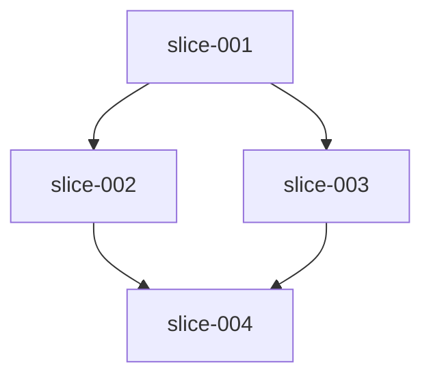

# 切片索引 — examples-finder-001

## 概览

| slice_id | title | priority | depends_on | backlog_ids | status |
| --- | --- | --- | --- | --- | --- |
| slice-001 | 公共类型、路径安全与 Walker | P0 | — | B-01, B-02, B-03, B-13（Walker/深度/symlink 相关 fixture） | pending |
| slice-002 | `finder path` 与 PathSearch | P1 | slice-001 | B-04（路径行格式化）, B-05, B-06, B-13（path 用 fixture） | pending |
| slice-003 | `finder text` 与 ContentSearch | P2 | slice-001 | B-04（TextHit 行格式化）, B-07, B-08, B-09, B-10, B-13（text 用 fixture） | pending |
| slice-004 | 退出码全链路、SIGINT、README、CI | P2 | slice-002, slice-003 | B-11, B-12, B-13（集成/补全）, B-14 | pending |

**Backlog 覆盖**：B-01–B-14 均已映射；B-14 为可选（slice-004 完成定义中含「若仓库已有 CI」）。

## 依赖关系

- **无环**：拓扑为 001 → {002,003} → 004。
- **并行性**：002 与 003 仅依赖 001，理论上可并行；若共享同一 CLI 入口文件（如单文件 `cli.py`），建议**串行**或事先拆分子命令模块以免冲突。本 run 推荐顺序：001 → 002 → 003 → 004。

## 修改范围原则（避免并行冲突）

| 切片 | 主要新增/修改范围（约定） |
| --- | --- |
| slice-001 | 包骨架、`types`/`paths`/`walker`、Walker 单测与最小 fixture |
| slice-002 | `path_search`、路径行输出（Output 的路径部分）、`path` 子命令与测试 |
| slice-003 | `content_search`、Output 的 TextHit 格式化、`text` 子命令、glob、测试 |
| slice-004 | README、全局退出码/SIGINT、CLI 聚合与集成测试、可选 CI |

## 输入文档

- 实现计划：`.workflow/docs/implementation-plan/finder-implementation-plan.md`
- Backlog：`.workflow/docs/implementation-plan/backlog.md`
- 规范化设计：`.workflow/docs/design/finder.normalized.md`
- Run brief：`.workflow/runs/examples-finder-001/run-brief.md`（当前无实质额外约束）

## 切片定义路径

- [`slice-001.md`](slice-001.md)
- [`slice-002.md`](slice-002.md)
- [`slice-003.md`](slice-003.md)
- [`slice-004.md`](slice-004.md)
