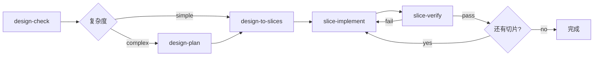

# 改造计划：引入 design-plan skill

## 背景

当前 skill 体系的核心流程为：

```
design-check → design-to-slices → slice-implement ↔ slice-verify
```

问题：`design-to-slices` 实际上混合了两个认知动作——理解整体结构 + 切出最小切片。对于复杂任务，缺少整体结构认知会导致切片质量下降、依赖关系事后暴露、切片边界不稳。

## 目标

在 `design-check` 和 `design-to-slices` 之间引入一个**轻量的** `design-plan` skill，用于建立整体执行结构认知，服务于后续切片。

## 改造后的核心流程



## 改造清单

### 1. 新建 `skill/design-plan/SKILL.md`

**职责**：建立整体执行结构认知（模块边界、主流程、关键接口、依赖关系、切片策略）

**最小输出**：
- `system_shape_summary` — 系统整体形态
- `main_flow` — 主执行流
- `module_boundaries` — 模块边界
- `dependency_notes` — 关键依赖
- `slice_strategy` — 切片策略建议

**不做**：
- 不生成大而全的 implementation plan
- 不生成 backlog
- 不写代码
- 不维护阶段状态

**可选文件输出**：`.workflow/session/design-plan.md`

**触发条件**：`design-check` 判断为 `complexity: complex` 时建议执行

### 2. 修改 `skill/design-check/SKILL.md`

需要改动的部分：

- **Procedure 第 4 步**：在现有三种结论基础上，为 `ready-for-slicing` 和 `ready-with-risks` 增加 `complexity` 维度（`simple` / `complex`）
- **Output**：最小输出增加 `complexity` 字段
- **建议格式**：Decision 部分增加 complexity 标注
- **Quality Gate**：增加"已评估复杂度"检查项

### 3. 修改 `skill/design-to-slices/SKILL.md`

需要改动的部分：

- **Input 表格**：增加 `design-plan 结果` 作为可选输入
- **Procedure 第 1 步**：增加从 `design-plan` 结果中读取结构认知的说明
- **When to Use**：增加"已完成 design-plan 的复杂任务"场景

### 4. 更新 `skill/manifest.json`

- 在 `layers.core` 数组中插入 `design-plan`（位于 `design-check` 之后、`design-to-slices` 之前）
- 在 `skills` 数组中增加 `design-plan` 条目：
  - `predecessors`: `["design-check"]`
  - `primaryOutputs`: `[".workflow/session/design-plan.md"]`
- 更新 `description` 中的流程描述

### 5. 更新 `skill/SKILL.md`

- **流程图**：在 `design-check` 和 `design-to-slices` 之间增加条件分支
- **Skill Registry Core 表格**：插入 `design-plan` 行（序号 2，后续顺延）
- **Core Flow**：在 Step 1 和 Step 2 之间增加 Step 1.5 说明
- **Minimal Session Layout**：增加 `design-plan.md` 文件

### 6. 更新 `skill/README.md`

- **第 3.1 节 Core 流程图**：增加条件分支
- **Core 表格**：增加 `design-plan` 行
- **第 4 节文件集合**：增加 `design-plan.md`
- **第 7.1 节推荐路径**：增加 `design-plan（复杂任务推荐）`

### 7. 更新 `AGENTS.md`

- **第 2 条 Core loop**：更新流程描述，增加 `design-plan` 为可选步骤

## 设计约束

- `design-plan` 是**条件性步骤**，简单任务可跳过
- 输出必须轻量，严格限制在结构认知范围内
- 遵循"一个 skill 只做一种认知动作"原则
- 不引入新的状态字段到 `state.md`
