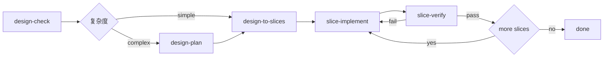

# AI 设计驱动实现 Toolkit

目标不是产出更多中间文档，而是让模型——尤其是较弱能力模型——也能稳定完成一个小步：理解设计、切出最小任务、实现它、验证它。

主入口见 [SKILL.md](SKILL.md)。该文件定义了新的系统分层、主技能集合、最小状态模型与推荐目录结构。

---

## 1. 动机


对弱模型会放大四类问题：

1. **长指令负担**：单个 skill 需要同时记住太多规则
2. **多产物耦合**：上一阶段输出格式一旦不稳定，下一阶段就开始漂移
3. **状态机过厚**：模型需要反复判断当前阶段、前置条件、输出落点
4. **中间文档过重**：模型把精力消耗在“写文档”而不是“做任务”


---

## 2. 第一性原则

系统基于以下原则：

### 2.1 真实任务优先于中间文档
只有真正能降低失败率的文档才保留。否则宁可不写。

### 2.2 一个 skill 只做一种认知动作
不再允许一个 skill 同时负责分析、归一化、规划、落盘、状态迁移。

### 2.3 默认允许不完整输入
设计不完整时，先标记风险和缺失；只要还能切出安全的小任务，就继续推进。

### 2.4 切片是主资产
大而全的 implementation plan 不是核心资产。真正对执行有价值的是高质量、边界清晰、可验证的切片。

### 2.5 状态最小化
只保存恢复所需要的信息，不维护厚重阶段表和多层报告索引。

### 2.6 增强能力后置
集成验证、结果归档、追踪矩阵等能力仍有价值，但应当作为增强层，而不是默认堵在核心路径前面。

---

## 3. 三层模型

### 3.1 Core：最小闭环
这是默认主流程。



包含五个 skill（其中 `design-plan` 为条件性步骤）：

| Skill | 文件 | 作用 |
|---|---|---|
| `design-check` | [design-check/SKILL.md](design-check/SKILL.md) | 从设计中提取目标、约束、风险、缺失，评估复杂度 |
| `design-plan` | [design-plan/SKILL.md](design-plan/SKILL.md) | 建立整体执行结构认知（复杂任务时使用） |
| `design-to-slices` | [design-to-slices/SKILL.md](design-to-slices/SKILL.md) | 直接把设计转成最小可验证切片 |
| `slice-implement` | [slice-implement/SKILL.md](slice-implement/SKILL.md) | 只实现一个切片 |
| `slice-verify` | [slice-verify/SKILL.md](slice-verify/SKILL.md) | 只验证一个切片 |

### 3.2 Infra：基础设施
不是业务核心，但支持恢复与续跑。

| Skill | 文件 | 作用 |
|---|---|---|
| `run-init` | [run-init/SKILL.md](run-init/SKILL.md) | 创建最小会话目录与状态文件 |
| `run-status` | [run-status/SKILL.md](run-status/SKILL.md) | 读取当前会话状态并给出下一步建议 |

### 3.3 Extensions：增强层
默认不阻塞主流程，只在需要时使用。

| Skill | 文件 | 作用 |
|---|---|---|
| `integration-verify` | [integration-verify/SKILL.md](integration-verify/SKILL.md) | 多切片通过后的集成验证 |
| `result-curate` | [result-curate/SKILL.md](result-curate/SKILL.md) | 将会话结果沉淀为长期可复用资产 |

---


---

## 4. 新的最小文件集合

旧体系默认创建大量阶段目录与报告文件。新体系改为最小集合。

推荐结构：

```text
.workflow/
└── session/
    ├── state.md
    ├── context.md
    ├── design-check.md
    ├── design-plan.md          # 复杂任务时生成
    ├── slices/
    │   ├── index.md
    │   ├── slice-001.md
    │   └── slice-002.md
    ├── verify/
    │   ├── slice-001-verify.md
    │   └── slice-002-verify.md
    └── summary.md
```

各文件含义：

| 文件 | 必须 | 作用 |
|---|---|---|
| `state.md` | 是 | 极简恢复状态 |
| `context.md` | 否 | 会话背景与固定约束 |
| `design-check.md` | 否 | 设计检查摘要与风险（含复杂度） |
| `design-plan.md` | 否 | 整体结构规划（复杂任务时生成） |
| `slices/index.md` | 建议 | 切片概览 |
| `slices/slice-NNN.md` | 是 | 单切片定义 |
| `verify/slice-NNN-verify.md` | 建议 | 单切片验证结果 |
| `summary.md` | 否 | 本次会话总结 |

---

## 6. 新的最小状态模型

相比旧的 [run-init/SKILL.md](run-init/SKILL.md) 中厚重 `state.md` 模板，新系统只保留恢复必需信息。

建议格式：

```markdown
# Session State

- objective: <...>
- design_doc: <...>
- status: active | blocked | completed
- current_slice: <...>
- last_completed_slice: <...>
- last_verify_result: pass | fail | none
- blocked: yes | no
- block_reason: <...>
```

它只回答四个问题：
1. 目标是什么
2. 当前在做哪个切片
3. 上一次验证结果是什么
4. 是否被阻塞

除了这些，其他信息尽量从切片文件和验证文件反推，而不是提前在状态表里展开维护。

---

## 7. 推荐使用方式

### 7.1 最小路径

对于大多数实现任务，推荐只走：

```text
run-init（可选）
design-check
design-plan（复杂任务推荐）
design-to-slices
slice-implement
slice-verify
```

### 7.2 什么时候执行扩展层

仅在以下场景下追加：

- 需要验证多个切片一起工作时，使用 [integration-verify/SKILL.md](integration-verify/SKILL.md)
- 需要形成可审计或可移交资产时，使用 [result-curate/SKILL.md](result-curate/SKILL.md)

### 7.3 什么时候不该继续推进

如果 [design-check/SKILL.md](design-check/SKILL.md) 发现：
- 目标本身不明确
- 范围完全不可界定
- 无法安全定义任意一个切片

则应停下并补充设计，而不是伪造计划或伪造切片。

如果 `design-check` 判断 `complexity: complex`，建议先执行 [design-plan/SKILL.md](design-plan/SKILL.md) 建立整体结构认知，再进入切片阶段。跳过 `design-plan` 不会阻塞流程，但可能导致切片质量下降。

---

## 8. 对 OpenCode / Cursor 的含义

本仓库依然使用 `skill/` 作为权威定义目录，并同步到：
- [`.opencode/skills/`](../.opencode/skills/)
- [`.cursor/skills/`](../.cursor/skills/)

但同步对象将改为新的核心体系。后续主同步对象应优先包含：
- [design-check/SKILL.md](design-check/SKILL.md)
- [design-plan/SKILL.md](design-plan/SKILL.md)
- [design-to-slices/SKILL.md](design-to-slices/SKILL.md)
- [slice-implement/SKILL.md](slice-implement/SKILL.md)
- [slice-verify/SKILL.md](slice-verify/SKILL.md)
- [run-init/SKILL.md](run-init/SKILL.md)
- [run-status/SKILL.md](run-status/SKILL.md)

---

## 9. 设计方向

本项目的核心方向：

- 默认主流程围绕最小切片闭环
- 用最少 skill 构成最小闭环
- 用最少状态支持恢复
- 用增强层承载高级治理需求

系统从"流程治理优先"转向"切片闭环优先"，这是所有 skill 设计的判断标准。
