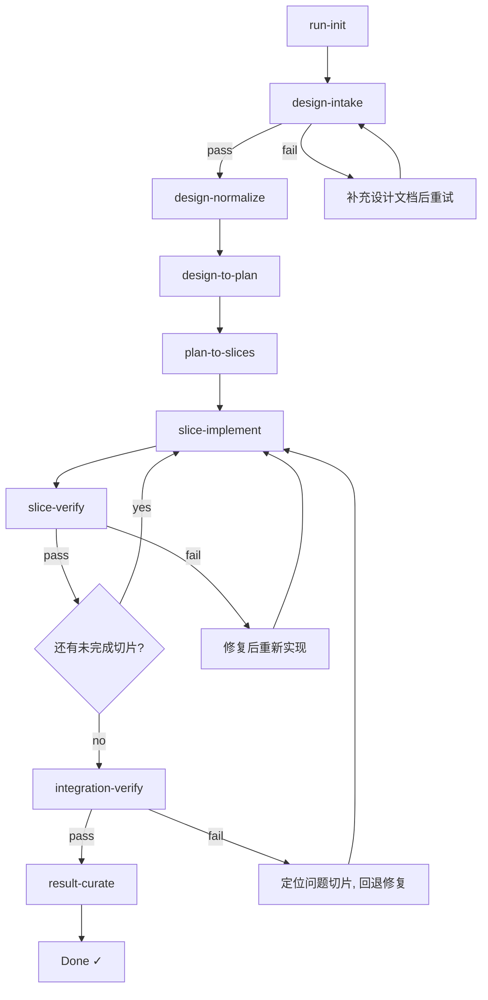
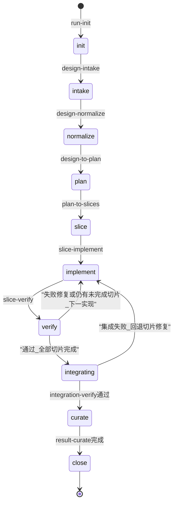

# AI Design-Driven Implementation Toolkit

## Overview

本 Toolkit 通过 Skill 化流水线解决三大问题：持续代码生成、质量保障、成果沉淀；**默认给 OpenCode 使用**（仓库根 [`AGENTS.md`](../AGENTS.md)、[`opencode.json`](../opencode.json)）。每个 Skill 是一个独立可执行的指令单元，按顺序串联形成完整的设计→实现→验证→归档流程。目录结构遵循 [superpowers skills 约定](https://github.com/obra/superpowers/tree/main/skills)：`skill/<skill-name>/SKILL.md`，含 YAML frontmatter（`name`、`description`）。

## Skill Registry

| # | Skill | Path | Purpose | Primary Input | Primary Output |
|---|-------|------|---------|---------------|----------------|
| 1 | run-init | [run-init/SKILL.md](run-init/SKILL.md) | 初始化运行目录与状态文件 | 项目路径 | `.workflow/runs/<run-id>/state.md` |
| 2 | design-intake | [design-intake/SKILL.md](design-intake/SKILL.md) | 验收设计文档结构完整性 | 设计文档 | intake 报告 (pass/fail) |
| 3 | design-normalize | [design-normalize/SKILL.md](design-normalize/SKILL.md) | 归一化多源设计材料为结构化 Markdown | 原始设计 + 补充材料 | `<name>.normalized.md` |
| 4 | design-to-plan | [design-to-plan/SKILL.md](design-to-plan/SKILL.md) | 设计文档转可执行实现计划 | 归一化设计文档 | 实现计划 + backlog + risks |
| 5 | plan-to-slices | [plan-to-slices/SKILL.md](plan-to-slices/SKILL.md) | 实现计划拆分为最小可验证切片 | 实现计划 | 切片任务文件集 |
| 6 | slice-implement | [slice-implement/SKILL.md](slice-implement/SKILL.md) | 执行单个切片的代码实现 | 切片定义 + 设计文档 | 业务代码 + 单元测试 |
| 7 | slice-verify | [slice-verify/SKILL.md](slice-verify/SKILL.md) | 验证单个切片的实现质量 | 切片代码 + 验证标准 | 验证报告 (pass/fail) |
| 8 | integration-verify | [integration-verify/SKILL.md](integration-verify/SKILL.md) | 验证多切片集成正确性 | 已验证切片集 | 集成验证报告 |
| 9 | result-curate | [result-curate/SKILL.md](result-curate/SKILL.md) | 归档整理所有运行产出物 | 全部运行产出 | 追溯矩阵 + 交付索引 |

### 工具 Skill（不推进流水线顺序）

用于解读状态与续跑指引，**不改变** `state.md` 中的阶段进度（可选仅写 `stages/plan/run-status.md` 审计）。

| Skill | Path | Purpose |
|-------|------|---------|
| run-status | [run-status/SKILL.md](run-status/SKILL.md) | 读取 `state.md`，输出摘要与建议下一步执行的 stage skill |

断点恢复时：可先执行 `run-status`，再按建议打开对应 `skill/<name>/SKILL.md`。

## Pipeline Flow



## Usage

### OpenCode（原生 `skill` 工具）

- **流水线索引**：本文件已通过根目录 [`opencode.json`](../opencode.json) 的 `instructions` 注入上下文。
- **按阶段加载完整指令**：在支持 OpenCode `skill` 工具的环境中，使用与各阶段 YAML `name` 一致的名称加载，例如调用 `skill` 工具并指定 `name: run-init`、`name: design-intake` 等。可发现条目来自 **`.opencode/skills/<name>/SKILL.md`**（与 `skill/<name>/SKILL.md` 内容同步）。
- **同步镜像**：修改 `skill/<name>/SKILL.md` 后执行 `scripts/sync-opencode-skills.ps1`（Windows）或 `scripts/sync-opencode-skills.sh`（Unix），再提交 `.opencode/skills/`，避免 OpenCode 与权威定义脱节。

### Cursor（项目 Skills + 规则）

- **项目 Skills**：**`.cursor/skills/<name>/SKILL.md`**，在对话中 `@` 引用对应文件即可按该阶段执行；与 `skill/` 内容一致，由 `scripts/sync-cursor-skills.ps1` 或 `scripts/sync-ide-mirrors.ps1` 同步。
- **工作区规则**：[`.cursor/rules/ai-design-toolkit.mdc`](../.cursor/rules/ai-design-toolkit.mdc)（可改为 `alwaysApply: true` 或手动 @ 引用）。
- **快捷命令**：[`.cursor/commands/`](../.cursor/commands/) 下提供常用入口（若你的 Cursor 版本支持项目 Commands）。
- 说明见 [`.cursor/README.md`](../.cursor/README.md)。

### 调用方式（通用 / Cursor）

每个阶段对应 `skill/<skill-name>/SKILL.md`。使用时：

1. 确保已执行 `run-init` 初始化运行环境
2. 按照 Pipeline 顺序依次调用对应 Skill
3. 每个 Skill 完成后检查 Quality Gate
4. 通过后更新 `state.md` 进入下一阶段

### 命令模式

```
请按照 skill/<skill-name>/SKILL.md 执行，输入为 <具体输入路径>
```

示例：

```
请按照 skill/design-intake/SKILL.md 执行，输入为 .workflow/docs/design/my-feature-design.md
```

## Runtime Directory Structure

与 `run-init`、`design-to-plan`、`slice-verify`、`result-curate` 及各阶段报告路径一致：

```
<project>/
├── .workflow/
│   ├── docs/
│   │   ├── design/
│   │   │   ├── <name>.md                    # 原始设计文档
│   │   │   └── <name>.normalized.md         # 归一化设计文档
│   │   └── implementation-plan/
│   │       ├── <name>-implementation-plan.md
│   │       ├── backlog.md
│   │       └── risks.md
│   └── runs/
│       └── <run-id>/
│           ├── state.md                     # 运行状态（含阶段表与切片表）
│           ├── run-brief.md                 # 本次 run 专用约束（可插拔；run-init 创建）
│           ├── slices/
│           │   ├── index.md                 # 切片索引（可选）
│           │   └── slice-<NNN>.md           # 切片定义
│           └── stages/                      # 按流水线阶段分目录的产出（详见各 stage skill）
│               ├── intake/
│               ├── normalize/
│               ├── plan/                    # 可选；如 run-status 审计落盘
│               ├── implement-verify/        # 切片实现说明、验证报告、偏差等
│               ├── integrate/
│               └── curate/                  # traceability-matrix、final-index 等归档产出
└── skill/
    ├── SKILL.md                             # 本文件 — 索引与约定说明
    ├── README.md                            # Toolkit 详细说明
    └── <skill-name>/
        └── SKILL.md                         # 各阶段 Skill（含 frontmatter）
```

细目与命名约定见 [`docs/superpowers/specs/2026-04-01-workflow-layout-design.md`](../docs/superpowers/specs/2026-04-01-workflow-layout-design.md)。`state.md` §6 产物索引中的路径应指向上述文件（例如 `verification_reports` → `.workflow/runs/<run-id>/stages/implement-verify/`）。**`run-brief.md`**：与 evergreen 设计分离；各节仅为「无」时不增加约束，见 [run-init/SKILL.md](run-init/SKILL.md)。

## State Machine

阶段名与 `state.md` §3 阶段表一致：`intake` → `normalize` → `plan` → `slice` → `implement` / `verify`（循环）→ `integrating`（集成验证）→ `curate` → `close`。顶层 `status`（如 `created`、`failed`、`completed`）与 `current_stage` 不同；run 创建后 `current_stage` 为 `init`，见 [run-init/SKILL.md](run-init/SKILL.md)。



## Quality Assurance

三层质量保障：

| Level | Mechanism | Description |
|-------|-----------|-------------|
| L1 | 设计一致性检查 | 每步产出与设计文档对照，确保不偏离 |
| L2 | 自动化检查 | 格式校验、lint、类型检查、单元测试、契约测试 |
| L3 | 人工审查 | 关键节点人工确认，处理模糊判断 |

## Failure Classification & Recovery

| Category | Description | Recovery Strategy |
|----------|-------------|-------------------|
| 设计缺陷 | 设计文档信息不足或矛盾 | 暂停流程，提请人工补充设计后从 intake 重试 |
| 实现偏差 | 代码实现偏离设计规格 | 回退到 slice-implement，对照设计修正 |
| 验证失败 | 测试不通过或质量门禁未达标 | 分析失败原因，修复后重新执行验证 |
| 环境问题 | 构建/测试环境异常 | 修复环境后从当前阶段断点恢复 |
