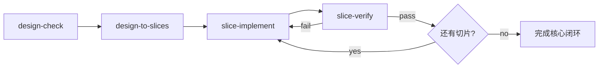

# AI Design-Driven Implementation Toolkit

## Overview

本 Toolkit 已按第一性原则重构：**默认围绕最小切片闭环工作，而不是围绕阶段文档工作**。

核心目标只有三个：

1. 让较弱能力的模型也能稳定推进
2. 让每一步都可验证、可回退
3. 让系统复杂度尽量留在结构中，而不是压给单次模型推理

因此，主流程不再要求先生成大量中间报告，也不再以 `intake → normalize → plan → slices` 的厚流水线作为默认路径。新的默认路径是：



---

## System Model

Toolkit 现在分为三层：

| Layer | Purpose | Default | Skills |
|---|---|---|---|
| Core | 最小可执行闭环 | 是 | `design-check`、`design-to-slices`、`slice-implement`、`slice-verify` |
| Infra | 会话初始化与只读恢复 | 是 | `run-init`、`run-status` |
| Extensions | 增强验证与归档沉淀 | 否 | `integration-verify`、`result-curate` |

### 设计原则

- **切片优先**：主资产是切片定义、代码改动、验证结果
- **单一职责**：每个 skill 只做一种认知动作
- **默认接受不完整输入**：设计不完整时先标风险，不自动扩张为文档治理链
- **最小状态**：只记录恢复所必需的信息
- **增强层可选**：集成验证与结果归档不是默认阻塞步骤

---

## Skill Registry

### Core

| # | Skill | Path | Purpose | Primary Input | Primary Output |
|---|---|---|---|---|---|
| 1 | design-check | [design-check/SKILL.md](design-check/SKILL.md) | 提取目标、约束、风险并判断是否足以开始切片 | 设计文档 | 轻量设计检查结果 |
| 2 | design-to-slices | [design-to-slices/SKILL.md](design-to-slices/SKILL.md) | 直接把设计转换为最小可验证切片 | 设计文档 / design-check 结果 | 切片定义集合 |
| 3 | slice-implement | [slice-implement/SKILL.md](slice-implement/SKILL.md) | 只实现一个切片，且严格遵守边界 | 单个切片定义 | 代码改动 + 必要测试 |
| 4 | slice-verify | [slice-verify/SKILL.md](slice-verify/SKILL.md) | 对单个切片做一致性检查与自动验证 | 单个切片 + 代码改动 | pass/fail 验证结果 |

### Infra

| Skill | Path | Purpose |
|---|---|---|
| run-init | [run-init/SKILL.md](run-init/SKILL.md) | 创建最小会话目录与极简状态文件 |
| run-status | [run-status/SKILL.md](run-status/SKILL.md) | 读取极简状态并给出下一步建议 |

### Extensions

| Skill | Path | Purpose |
|---|---|---|
| integration-verify | [integration-verify/SKILL.md](integration-verify/SKILL.md) | 多切片通过后执行集成级验证 |
| result-curate | [result-curate/SKILL.md](result-curate/SKILL.md) | 将本次会话整理为可复用资产 |

---

## Core Flow

### Step 0: 可选初始化

如果需要显式会话目录与恢复点，先执行 [run-init/SKILL.md](run-init/SKILL.md)。

### Step 1: 设计检查

执行 [design-check/SKILL.md](design-check/SKILL.md)：
- 读取设计文档
- 提取目标、范围、约束
- 标记缺失项与风险
- 判断是否足以开始切片

### Step 2: 直接拆切片

执行 [design-to-slices/SKILL.md](design-to-slices/SKILL.md)：
- 不先生成厚 implementation plan
- 直接产出最小可验证切片
- 每个切片都应具备目标、边界、依赖、验证方式

### Step 3: 单切片实现

执行 [slice-implement/SKILL.md](slice-implement/SKILL.md)。

### Step 4: 单切片验证

执行 [slice-verify/SKILL.md](slice-verify/SKILL.md)。

### Step 5: 按需增强

在需要时，再执行：
- [integration-verify/SKILL.md](integration-verify/SKILL.md)
- [result-curate/SKILL.md](result-curate/SKILL.md)

---

## Minimal Session Layout

新体系推荐的最小目录如下：

```text
.workflow/
└── session/
    ├── state.md
    ├── context.md
    ├── design-check.md
    ├── slices/
    │   ├── index.md
    │   └── slice-001.md
    ├── verify/
    │   └── slice-001-verify.md
    └── summary.md
```

如果需要多会话并行，可扩展为：

```text
.workflow/
└── sessions/
    └── <session-id>/
        ├── state.md
        ├── context.md
        ├── slices/
        └── verify/
```

---

## Minimal State Model

`state.md` 不再维护复杂阶段表与切片总表，只保留恢复所必需的信息：

```markdown
# Session State

- objective: <...>
- design_doc: <...>
- status: active | blocked | completed
- current_slice: <...>
- last_completed_slice: <...>
- last_verify_result: pass | fail | none
- blocked: yes | no
- block_reason: <...>
```

---

## Usage

### 通用调用方式

```text
请按照 skill/<skill-name>/SKILL.md 执行，输入为 <具体路径>
```

### 推荐顺序

```text
run-init（可选）
design-check
design-to-slices
slice-implement
slice-verify
```

### 何时使用扩展层

只有在以下情形下再进入扩展层：
- 已有多个切片通过，需要整体链路验证
- 需要形成可审计、可移交、可复用的总结材料


